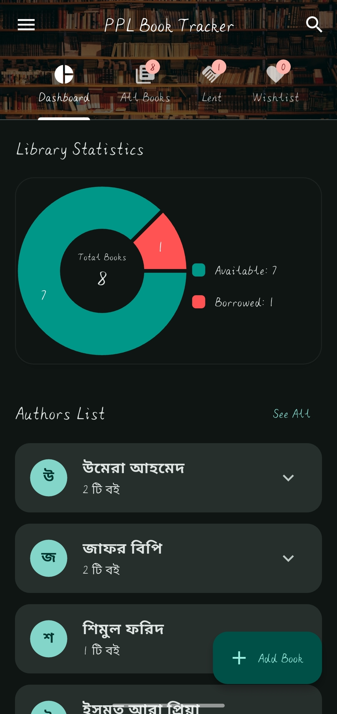
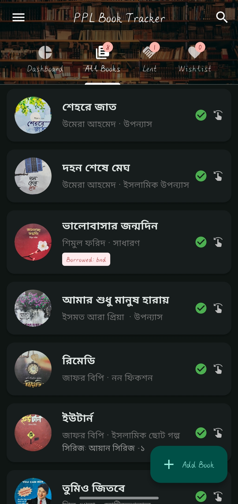
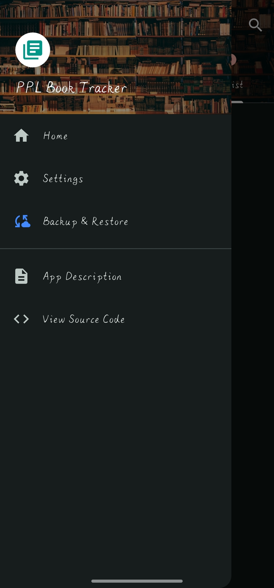
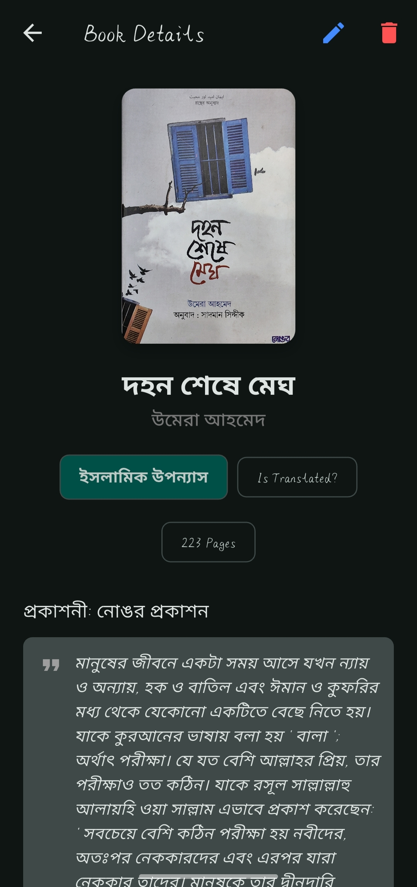

# 📚 PPL Book Tracker

**A beautiful, fully-featured personal library management app built with Flutter.**
Organize, track, and visualize your books — including lending info, read status, wishlist, backups, and statistics — all in one place! 🚀

---

## 🧠 What Is This App?

**PPL Book Tracker** is a cross-platform Flutter application that helps users manage their personal book collection without relying on external services. It stores books locally using shared preferences and allows:

* Adding books manually or via ISBN lookup from Google Books API
* Tracking read/unread status
* Marking books as Wishlist
* Recording lending/borrowing details
* Organizing books by author, category, and more
* Viewing quick charts and statistics about your library

All data can be backed up or restored using JSON files — including *book cover images* encoded in Base64 — giving complete control and portability over your library data.

---

## ⚙️ Key Features

### 📘 Library Management

* Add books manually or by ISBN search
* Edit details like title, author, category, pages, publisher, series, and notes
* Add a custom cover image from camera or gallery
* Mark books as **Read**, **Wishlist**, and **Borrowed**
* Store borrower’s name, contact, and borrow date

### 📊 Dashboard & Statistics

* Dashboard shows insights with a **Pie Chart** of books
* Highlights total, read, unread, and lent books
* Displays **Top Authors** sorted by book count
* View all authors with expandable lists

### 🔍 Smart UI & UX

* Search books by title, author, or category
* Smooth auto-hiding FAB (Floating Action Button) while scrolling
* Clean tab-based views for All, Lent, Wishlist & Dashboard
* Intuitive UI with responsive Material Design

### 💾 Backup & Restore

* Export your complete library (including Base64 encoded cover images) into a JSON backup file
* Import and restore backup files instantly
* Ensures data safety and portability

### 🌍 Customizable

* Light & Dark theme support
* Language support (English & Bangla)
* Adjustable text scale for accessibility

---

## 📌 Technologies Used

* 🌐 **Flutter** — Cross-platform UI framework
* 🗃️ **Shared Preferences** — Local storage
* 📦 **file_picker** — Backup file export/import
* 🖼️ **image_picker & image_cropper** — Image selection and cropping
* 📊 **fl_chart** — Dashboard charts
* 🔗 **url_launcher** — Open URLs externally
* 🔁 **flutter_slidable** — Item action panels

This app is lightweight, offline-ready, and built to give total control of your book collection without needing an internet connection.

---

## 🗂 Screenshots

## 📱 App Screenshots









---

## 🚀 Getting Started

### Prerequisites

* Flutter SDK installed
* Android Studio / VS Code

### Run Locally

```bash
git clone https://github.com/nazmuzChakib/PageTurn_Personal_Library.git
cd PageTurn_Personal_Library
flutter pub get
flutter run
```

---

## 🤝 Contributing

Contributions are welcome! ✨
Whether it’s new features, bug fixes, UI improvements, or translations — feel free to open an issue or submit a pull request.

---

## ❤️ Support

If you enjoy using **PPL Book Tracker**, give this repository a ⭐️ on GitHub!
Your support helps us build even better features for this community-driven app.

---

## 📄 License

This project is open-source and available under the **MIT License**.

---
